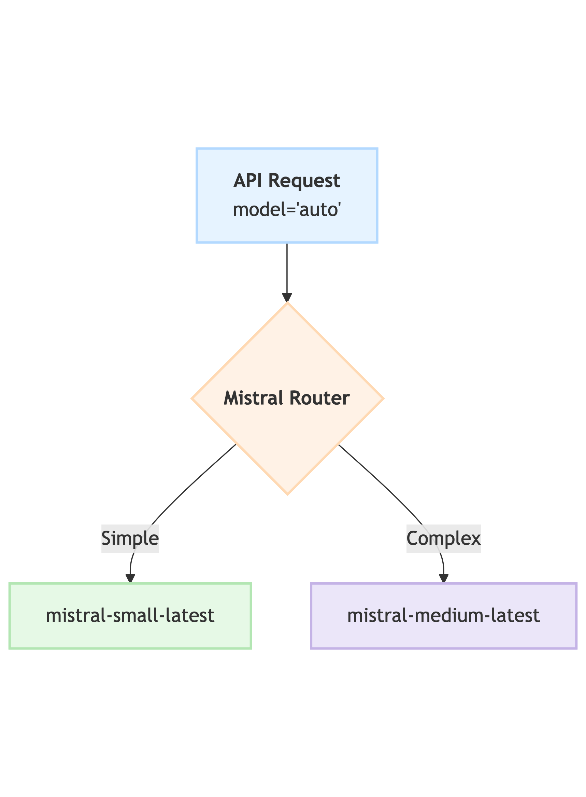

# `mistral-router`

A lightweight API gateway built with Python and FastAPI. It acts as a smart proxy for the **Mistral AI API**, **automatically routing requests to the most appropriate and cost-effective model** (small vs. medium) based on the request's content and requirements.

The goal is to drastically reduce API costs by using cheaper, faster models for simple queries, while transparently escalating to more powerful models for complex tasks, ensuring both cost-efficiency and high-quality responses.

<p align="center">
  
</p>

## Problem & Solution

### The Problem

Using a single, powerful Mistral AI model (e.g., `medium-latest`) for all tasks is simple but financially inefficient. Simple queries, like "What is the capital of France?", are billed at the same high rate as complex, multi-page analysis tasks. This leads to unnecessarily high costs and often slower response times for simple prompts.

### The Solution

This service introduces a "virtual" model called **`"auto"`**. When a request is sent to `"auto"`, the gateway analyzes it against a set of rules to determine its complexity.

* **Simple prompts** are routed to the **small model**, saving cost and improving latency.
* **Complex prompts** (e..g., those requiring reasoning, function calling, or JSON output) are routed to the **medium model**.
* **Resilience** is built-in: if the small model fails or returns a low-quality response, the service automatically retries the request with the medium model, ensuring the user still gets a valid answer.

### Cost Savings

This routing logic can lead to significant cost reductions. Based on the pricing defined in the project's configuration, the cost-saving potential is clear:

| Model | Input Cost (per 1M tokens) | Output Cost (per 1M tokens) |
| :--- | :--- | :--- |
| **Small** | $0.10 | $0.30 |
| **Medium** | $0.40 | $2.00 |
| **Savings** | **4x** | **\~6.7x** |

This gateway provides up to **\~6x cost-saving potential** on simple queries.

-----

## Evaluation & Performance

The router's effectiveness is not just theoretical. A benchmark script (`eval.py`) was run against a test suite of 20 prompts (10 simple, 10 complex) to compare the router policy against a baseline policy of "always using the medium model."

The results, stored in `eval_results.json`, confirm the router's accuracy and efficiency.

### Benchmark Results (`eval_results.json`)

| Policy | Total Cost (USD) | Avg. Latency (ms) | Routing Accuracy |
| :--- | :--- | :--- | :--- |
| **Router** | **$0.0444** | 17,230 ms | **100%** (20/20) |
| **Baseline** | $0.0487 | 18,361 ms | N/A |

#### Savings

* **Cost Reduction (USD): $0.00429**
* **Cost Reduction (Percent): 8.81%**

*Note: The 8.81% saving reflects this specific 50/50 test suite. Workloads with a higher percentage of simple queries will realize significantly greater savings, approaching the theoretical maximum.*

-----

## How It Works: Architecture & Routing Logic

The gateway acts as a proxy layer. All routing logic is contained within the service, requiring no changes to the client application other than updating the API endpoint.

The router applies rules in the following order of priority:

1. **Manual Override**: If the user specifies an exact model (e.g., `mistral-small-latest` or `mistral-medium-latest`), the router honors that choice.
2. **Capability-Required**: The request is routed to **medium** if it uses features the small model doesn't support, such as:
      * `tools` (function calling)
      * `response_format: {"type": "json_object"}`
3. **Heuristic Analysis**: The request is routed to **medium** if it's flagged as "complex" by any of the following heuristics (configurable in `.env`):
      * **Conversation Length**: `len(messages) > ROUTER_CONVERSATION_THRESHOLD` (Default: 6)
      * **Token Estimate**: `estimated_tokens > ROUTER_TOKEN_THRESHOLD` (Default: 150)
      * **Prompt Length**: `total_length > ROUTER_LENGTH_THRESHOLD` (Default: 120)
      * **Complexity Keywords**: The prompt contains keywords like *analyze, compare and contrast, evaluate, derive, synthesize, complex, etc.*
4. **Default**: If no other rule matches, the request is considered "simple" and is routed to the **small model**.

-----

## Setup and Usage

This project is designed to be easy to set up and run.

### 1\. Prerequisites

First, clone the repository and install the required Python packages.

```bash
git clone https://github.com/jathurchan/mistral-router.git
cd mistral-router
pip install -r requirements.txt
```

### 2\. Environment Configuration

The service is configured using environment variables. Copy the example file to create your own configuration:

```bash
cp .env.example .env
```

Now, edit the `.env` file and add your API key:

```ini
# .env
MISTRAL_API_KEY=your_mistral_api_key_here
```

### 3\. Running the Service

You can run the service directly with `uvicorn` or use the provided `docker-compose` file for a containerized setup.

#### Option A: Docker (Recommended)

This is the easiest way to run the service and is consistent with the `eval.py` test script. The `docker-compose.yml` file will build the image and run the service, exposing it on port **8001**.

```bash
docker-compose up --build
```

The service is now running at `http://localhost:8001`.

#### Option B: Local Uvicorn

You can also run the FastAPI app directly. It will run on port **8000** by default.

```bash
uvicorn app.main:app --reload
```

-----

## API Usage & Demo

Use the Mistral API Router as a drop-in replacement for the official Mistral API by pointing your client to the router's URL (e.g., `http://localhost:8001`) and setting `"model": "auto"`.

> *All examples below assume you are using the docker-compose setup on port 8001*

### Example 1: Simple Request → `small`

This simple prompt will be routed to the `small` model.

```bash
curl -i -X POST http://localhost:8001/v1/chat/completions \
 -H "Content-Type: application/json" \
 -H "Authorization: Bearer $MISTRAL_API_KEY" \
 -d '{
    "model": "auto",
    "messages": [{"role": "user", "content": "What is the capital of France?"}]
 }'
```

**Response Headers:**

```plaintext
HTTP/1.1 200 OK
...
x-router-model: mistral-small-latest
x-router-model-logical: small
x-router-reason: default_small
x-router-cost-usd: 0.0000181
x-router-latency-ms: 998.29
...
```

The response body is the standard API completion. The headers show the router's decision-making.

### Example 2: Complex Request → `medium`

This prompt uses the keyword "Analyze", triggering the `heuristic_keyword` rule and routing to the `medium` model.

```bash
curl -i -X POST http://localhost:8001/v1/chat/completions \
 -H "Content-Type: application/json" \
 -H "Authorization: Bearer $MISTRAL_API_KEY" \
 -d '{
    "model": "auto",
    "messages": [{"role": "user", "content": "Analyze the pros and cons of renewable energy."}]
 }'
```

**Response Headers:**

```plaintext
HTTP/1.1 200 OK
...
x-router-model: mistral-medium-latest
x-router-model-logical: medium
x-router-reason: heuristic_keyword
x-router-cost-usd: 0.0038508
x-router-latency-ms: 28263.67
...
```

### Example 3: Manual Override

You can always bypass the router logic by specifying an exact model.

```bash
curl -i -X POST http://localhost:8001/v1/chat/completions \
 -H "Content-Type: application/json" \
 -H "Authorization: Bearer $MISTRAL_API_KEY" \
 -d '{
    "model": "mistral-medium-latest",
    "messages": [{"role": "user", "content": "What is the capital of France?"}]
 }'
```

**Response Headers:**

```plaintext
HTTP/1.1 200 OK
...
x-router-model: mistral-medium-latest
x-router-model-logical: medium
x-router-reason: manual_override
...
```

### Example 4: Observability & Metrics

The service exposes a Prometheus-compatible metrics endpoint for monitoring.

```bash
curl http://localhost:8001/metrics
```

**Output:**

```plaintext
# HELP router_requests_total Total number of requests processed
router_requests_total{fallback="false",model="small",status_code="200"} 10.0
router_requests_total{fallback="false",model="medium",status_code="200"} 10.0
# HELP router_request_latency_ms Request latency in milliseconds
router_request_latency_ms_bucket{le="1000.0",model="small"} 4.0
...
# HELP router_cost_usd Request cost in USD
router_cost_usd_bucket{le="0.005",model="medium"} 9.0
...
# HELP router_tokens_total Total tokens processed
router_tokens_total{model="small",type="input"} 107.0
router_tokens_total{model="small",type="output"} 1341.0
router_tokens_total{model="medium",type="input"} 236.0
router_tokens_total{model="medium",type="output"} 22944.0
# HELP router_active_requests Number of requests currently being processed
router_active_requests 0.0
```

-----

## How to Test

The project's functionality can be easily verified using the provided evaluation script.

### Evaluation Script

To replicate the benchmark results and test the live router, you can run the `eval.py` script. This script runs the full test suite against the live `"auto"` endpoint and the baseline ("always medium") policy.

**Make sure the router is running (e.g., via `docker-compose up`) before you run this.**

```bash
# Ensure your MISTRAL_API_KEY is exported in your shell
export MISTRAL_API_KEY="your_key_here"

# Run the evaluation
python eval.py
```

The script will print a summary of the results and save the full, detailed output to `eval_results.json`.

-----

## Future Work

This MVP provides a solid, production-ready foundation. Future enhancements could include:

* **Streaming Support**: The current version does not support `stream: true` and will return a 400 error.
* **ML-based Routing**: Train a small classifier (or use the `small` model itself) to predict prompt "difficulty" for more nuanced routing decisions.
* **Per-User Policies**: Allow users to set budgets or preferences (e.g., "prefer\_cost" vs. "prefer\_latency") via API keys.
* **A/B Testing**: Implement "shadow routing" to test new routing logic in parallel without impacting users.

## Author

Jathurchan Selvakumar

## License

This project is licensed under the MIT License. See the [LICENSE](/LICENSE) file for details.
